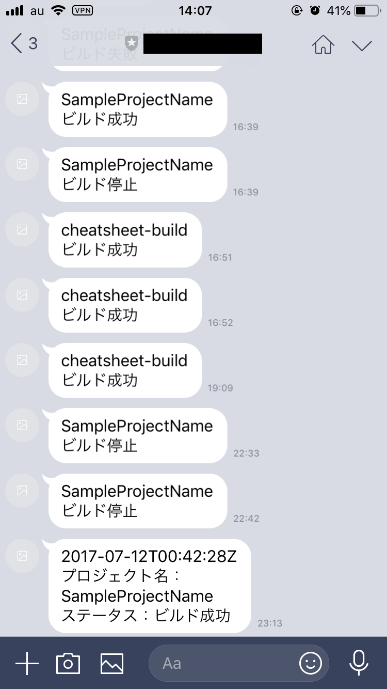
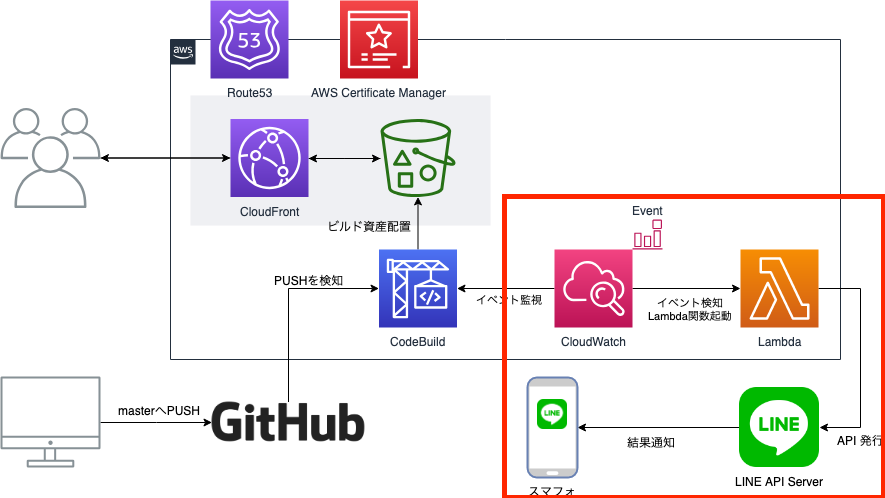

# What's this...

AWS CodeBuildのビルド結果をLINEに通知するLambda関数です。

## 環境構成

VuePressで作成した静的WebサイトをAWS CloudFront + S3でホスティングしており  
ソースをGitHubから取得しAWS CodeBuildでビルド＆デプロイを実行しています。

このLambda関数では赤枠内のビルド結果通知のAPI発行部分を担っています。

# 関連ブログ記事
このプロジェクトに関連するブログ記事です。

* [AWS CodeBuildのビルド結果をLambdaを使ってLINEへ通知する \- あとらすの備忘録](https://kitigai.hatenablog.com/entry/2019/04/14/163338)
* 
* 

# 関連プロジェクト
本プロジェクトは下記のプロジェクトと関連しています。

* [Lycheejam/my\-cheatsheet](https://github.com/Lycheejam/my-cheatsheet)
* 
* 